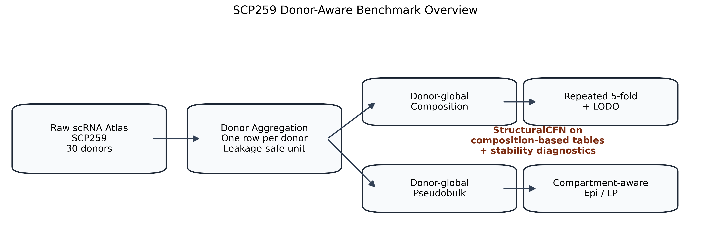
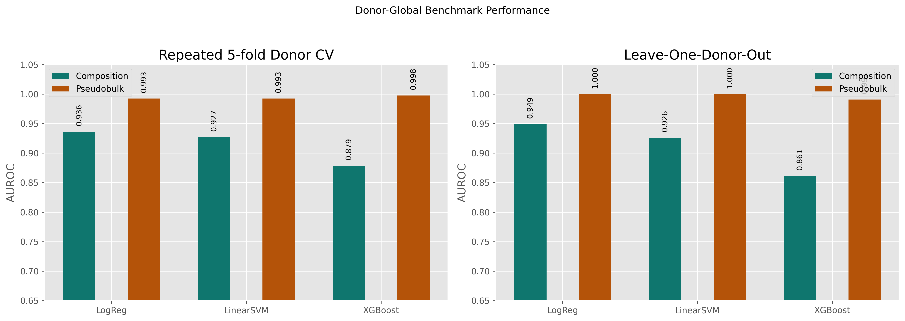
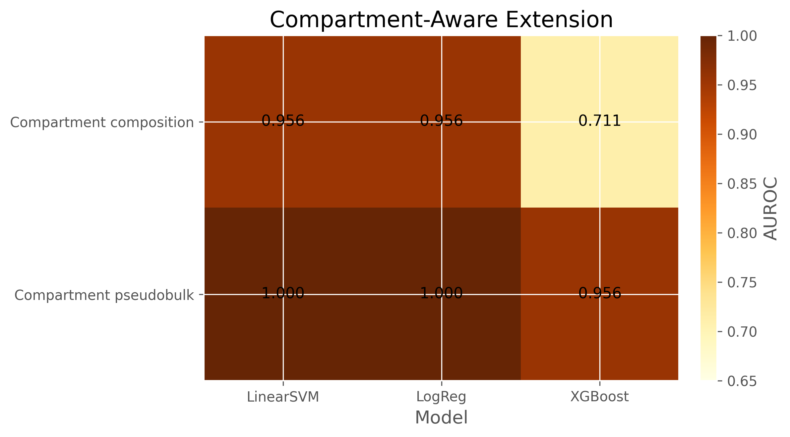
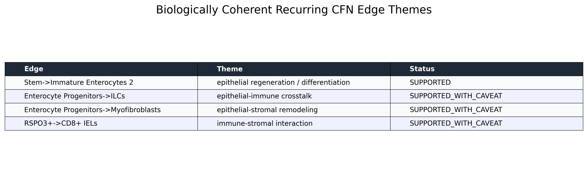

# sfn-scrna-study

Donor-aware single-cell RNA benchmarking workspace, currently centered on the
ulcerative colitis atlas `SCP259` and a first evaluation of StructuralCFN on
donor-level scRNA representations.

  

## Current status

This repo is no longer only a planning workspace. The `SCP259` benchmark is
implemented and analyzed.

Completed:

- donor-aware `Healthy` vs `UC` benchmark definition
- donor-global composition and pseudobulk tables
- repeated 5-fold donor CV and leave-one-donor-out robustness checks
- compartment-aware `Epi` / `LP` extensions
- first StructuralCFN runs on donor-global and compartment-aware composition
- structural diagnostics:
  - top-k overlap
  - sign consistency
  - consensus support
  - full dependency-matrix similarity
- first-pass biological annotation of recurring CFN edges

## Current SCP259 claim

The current defensible claim is:

> Donor-level UC versus Healthy prediction is robustly learnable in `SCP259`.
> Donor pseudobulk is the strongest predictive representation. StructuralCFN is
> predictive on composition-based representations and recovers biologically
> coherent edge themes, but its unconstrained structure does not recur stably
> across folds at `N=30`.

This is therefore an honest benchmark paper story, not yet a stable-mechanism
or “CFN beats all baselines” story.

## Key Figures

  

<em>Figure 4: Donor-global benchmark results across representations</em>

  

<em>Figure 5: Compartment-aware extension heatmap</em>

  

<em>Figure 7: Biologically annotated recurring CFN edge themes</em>

## Start here

If you are reviewing the project for the first time, use this order:

1. [`docs/active/uc_first_paper_writeup.md`](docs/active/uc_first_paper_writeup.md)
2. [`docs/active/scp259_analysis_completion_report.md`](docs/active/scp259_analysis_completion_report.md)
3. [`docs/active/scp259_visual_asset_manifest.md`](docs/active/scp259_visual_asset_manifest.md)
4. [`results/uc_scp259/reports/scp259_final_benchmark_tables.csv`](results/uc_scp259/reports/scp259_final_benchmark_tables.csv)
5. [`results/uc_scp259/cfn_benchmarks/uc_recurring_edge_annotation_final_v3.csv`](results/uc_scp259/cfn_benchmarks/uc_recurring_edge_annotation_final_v3.csv)

## Main documents

- [`docs/active/uc_first_paper_writeup.md`](docs/active/uc_first_paper_writeup.md):
  main SCP259 writeup with figures embedded directly in the text
- [`docs/active/scp259_analysis_completion_report.md`](docs/active/scp259_analysis_completion_report.md):
  frozen SCP259 benchmark contract, final tables, figure list, and current
  claim
- [`docs/active/scp259_visual_asset_manifest.md`](docs/active/scp259_visual_asset_manifest.md):
  figure inventory and asset map for the generated visuals
- [`docs/reference/uc_cluster_glossary.md`](docs/reference/uc_cluster_glossary.md):
  plain-language explanation of atlas cluster names
- [`docs/reference/uc_preprocessing_decisions.md`](docs/reference/uc_preprocessing_decisions.md):
  preprocessing decisions for the donor-level benchmark

## Main result artifacts

- Donor-global representation comparison:
  [`results/uc_scp259/benchmarks/donor_global_representation_comparison.csv`](results/uc_scp259/benchmarks/donor_global_representation_comparison.csv)
- Final benchmark table export:
  [`results/uc_scp259/reports/scp259_final_benchmark_tables.csv`](results/uc_scp259/reports/scp259_final_benchmark_tables.csv)
- Donor-global CFN summary:
  [`results/uc_scp259/cfn_benchmarks/donor_cluster_props_cfn_full_summary.csv`](results/uc_scp259/cfn_benchmarks/donor_cluster_props_cfn_full_summary.csv)
- Compartment-aware CFN summary:
  [`results/uc_scp259/cfn_benchmarks/donor_compartment_cluster_props_cfn_full_summary.csv`](results/uc_scp259/cfn_benchmarks/donor_compartment_cluster_props_cfn_full_summary.csv)
- CFN matrix similarity comparison:
  [`results/uc_scp259/cfn_benchmarks/cfn_matrix_similarity_comparison.csv`](results/uc_scp259/cfn_benchmarks/cfn_matrix_similarity_comparison.csv)
- Curated recurring-edge interpretation:
  [`results/uc_scp259/cfn_benchmarks/uc_recurring_edge_annotation_final_v3.csv`](results/uc_scp259/cfn_benchmarks/uc_recurring_edge_annotation_final_v3.csv)

## Repository layout

- `docs/active/`: current paper-facing and review-facing documents
- `docs/reference/`: supporting dataset, preprocessing, and interpretation notes
- `docs/archive/`: older planning documents retained for history
- `scripts/`: preprocessing, evaluation, and diagnostic utilities
- `results/`: small summary artifacts and paper-facing tables
- `data/`: local raw and processed data folders

## Data tracking policy

Raw and processed data are intentionally not tracked in git.

Ignored by default:

- `data/raw/`
- `data/processed/`
- `artifacts/`

Tracked by default:

- docs
- scripts
- benchmark summaries
- CFN summaries
- small paper-facing result tables

## What is next

The current priority is not new modeling infrastructure. It is:

1. finish SCP259 paper framing
2. get professor / expert feedback on the SCP259 writeup
3. then decide whether larger-cohort expansion is justified to test the
   sample-size hypothesis for CFN structure stability
