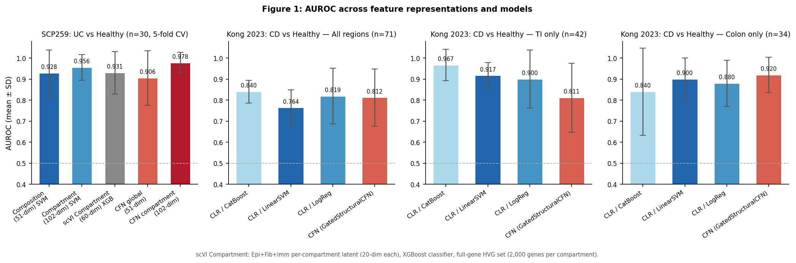
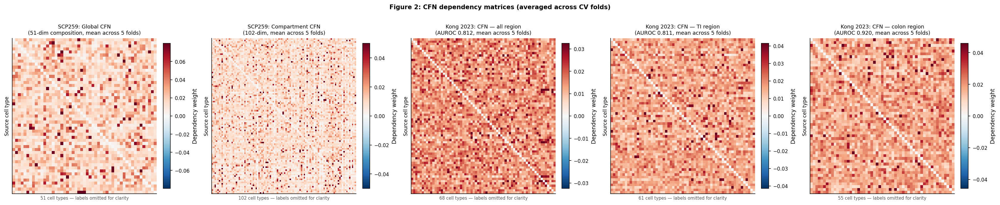
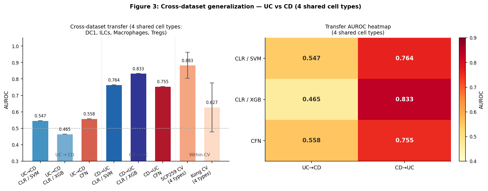

# sfn-scrna-study

This project benchmarks three feature representations for donor-level classification
of inflammatory bowel disease (IBD) from single-cell RNA sequencing data. The
representations are CLR-transformed cell type composition, GatedStructuralCFN
dependency embeddings, and scVI variational autoencoder latent embeddings. Two
independent IBD cohorts were used: the SCP259 ulcerative colitis atlas (30 donors,
51 cell types) and the Kong 2023 Crohn's disease atlas (71 donors, 55–68 cell
types across three intestinal regions). All evaluations use strict donor-aware
cross-validation in which no cell or derived feature from a test donor appears in
any training fold. The main finding is that CFN adds measurable discriminative
value over linear baselines specifically in the colon region of CD (AUROC 0.960
vs. linear 0.900 after feature filtering), while linear CLR models dominate in
the terminal ileum. Compartment-stratified composition is critical for both
classification performance and for recovering reproducible CFN dependency
structure across folds. All code, processed result tables, and publication
figures are in this repository. Raw data are not tracked (see below).

Contact: Jonathan Muhire, Oklahoma Christian University —
jonathan.muhire@eagles.oc.edu

---

## Results in brief

| Setting | Method | AUROC |
|---|---|---|
| SCP259 compartment CLR | LinearSVM | 0.956 ± 0.061 |
| SCP259 compartment CFN | GatedStructuralCFN | 0.978 ± 0.050 |
| Kong TI CLR | CatBoost | 0.967 ± 0.075 |
| Kong colon CFN (filtered) | GatedStructuralCFN | 0.960 ± 0.055 |
| SCP259 compartment scVI | XGBoost | 0.931 ± 0.101 |
| Cross-dataset CD→UC CLR | XGBoost | 0.833 |

All AUROC values are from 5-fold donor-stratified cross-validation except the
cross-dataset row, which is a single full-cohort transfer evaluation.

---

## Repository layout

```
paper/          LaTeX source (main.tex, references.bib) and compiled PDF
scripts/        Python analysis scripts, run in order described below
results/        Figures, baseline summaries, CFN results, cross-dataset output
  figures/      Publication-ready PNG and PDF figures
  uc_scp259/    SCP259 baselines, CFN benchmarks, and legacy figure assets
  kong2023_cd/  Kong 2023 baselines (raw and clean), CFN results, cross-dataset
  cross_dataset_cfn_4types/  Four-shared-type transfer experiment outputs
data/           Raw and processed data (gitignored)
docs/active/    Markdown drafts, section writeups, completion reports
```

---

## How to reproduce

Run scripts in this order from the repo root. Each script reads from `data/`
and writes to `results/`.

```bash
# 1. Build clean composition features for both cohorts
python scripts/build_clean_features.py

# 2. Run CLR baselines (SCP259 and Kong 2023)
python scripts/run_clr_baselines.py
python scripts/run_kong2023_baselines.py

# 3. Run CFN on both cohorts
python scripts/run_consensus_cfn.py
python scripts/run_cfn_kong.py

# 4. Run cross-dataset transfer experiment
python scripts/run_crossdataset_cfn.py

# 5. Generate publication figures
python scripts/make_figures.py
```

Raw SCP259 data must be downloaded separately (see `scripts/download_uc_scp259.sh`
for the URL list). Kong 2023 data are available from NCBI GEO accession GSE202021.

---

## Figures

**Figure 1** — AUROC across all methods, broken down by cohort and region.



**Figure 2** — CFN dependency matrices averaged across cross-validation folds,
comparing global vs. compartment formulations.



**Figure 3** — Cross-dataset transfer AUROC for the four shared cell types,
showing the CD→UC vs. UC→CD directional asymmetry.



---

## Paper

The manuscript is at `paper/main.pdf`. The arXiv preprint will be posted to
quantitative biology → Genomics prior to journal submission. Source code and
all result artifacts are at:
https://github.com/Jonathan-321/sfn-scrna-study
